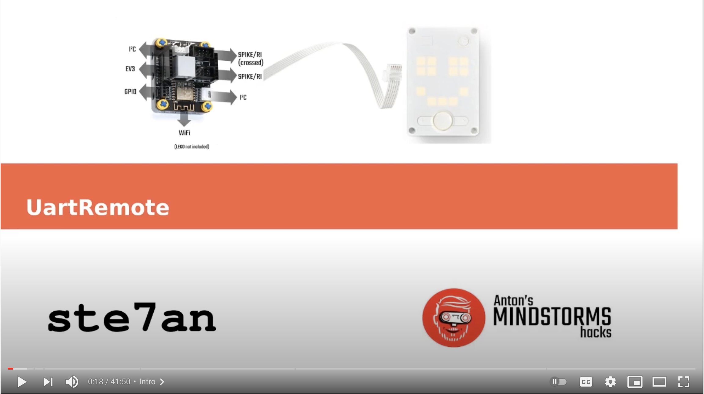

# Remote UART library: uartremote.py

This is a library for robust, near real-time communication between two UART devices. We developed it with LEGO EV3, SPIKE Prime and other MicroPython (ESP) modules. The library has the following properties:
- It is fast enough to read sensor data at 30-50Hz.
- It is fully symmetrical, so master and slave can have the same import.
- It includes a RAW REPL mode to upload code to a slave module. This means you can develop code for both modules in one file.
- It is implemented in MicroPython and Arduino/C code. With arduino code, much higher sensor reading speeds are possible, but flashing is a bit less user friendly.
- The library has a command loop to wait and listen for calls. That loop is customizable and non-blocking so you can add your own code to it.
- The C-struct-like encoding is included in the payload, so the other side always knows how to decode it.

## Micropython

Uniform library that works on standard MicroPython platforms, the EV3 and the Spike. See [example code and usage in the MicroPython subdirectory](MicroPython/README.md).

There is also a YouTube tutorial here:
[](https://www.youtube.com/watch?v=3U67RWEsXiU)

## Arduino

The same UartRemote library is also implemented for Arduino.

# Packet format
When a command with its accompanying values is transmitted over the Uart, the following packet format is used:

|delimiter|total len|command len|command|format len| format| data|delimiter|
|---------|---------|-----------|-------|----------|-------|-----|---------|
| `<`      |  `ln`   | `lc`    | `cmd` | `lf`    | `f` | binary data | `>`|

with
- `ln` the length of the total packet encoded as a single byte,
- `lc` the length of the command string `<cmd>` as a single byte,
- `cmd` the command specified as a string,
- `lf` the length of the format string
- `f` the Format encapsulation to pack the values; This can be `repr` for encapsulating arbitrary objects, `raw` for no encapsulation, or a Python struct format string.
- `data` a number of values encapsulated according to `f`.

When the method

`ur.send_command('test','repr',[1,2,3,4,5])`
is used, the following packet will be transmitted over the line:

```b'<b'\x1c\x04test\x04repr([1, 2, 3, 4, 5],)>'```

## Format Option 1: python struct.pack
This option interpretes the Format string `f` as the format string of the `struct.pack/unpack` method (see https://docs.python.org/3/library/struct.html), for example 

```send_command('test_struct','3b3s1f',1,2,3,"ale",1.3)```.

This is the fastest method (1ms) but is limited to c-types, like int, unsigned int etc...

## Format Option 2: repr/pickle
This uses the string representation of data, `repr()` to encode it. Then `eval()` is used on the receiving end.

`ur.encode('test_command', 'repr', [[1,2],[3,4]])`

will be encoded as:

`b'%\x0ctest_command\x04repr([[1, 2], [3, 4]],)'`

Here's the power of repr:

`ur.encode('test_command','repr',[[1,2],[3,str],[len,True],[2+3]])`

becomes

`b"W\x0ctest_command\x04repr([[1, 2], [3, <class 'str'>], [<built-in function len>, True], [5]],)"`

This is slower (7ms) and incompatible with Arduino but it is more flexible.

## Format Option 3: raw bytes
This is the fastest option of all, but you'll have to do your own decoding/encoding.

`ur.encode('test_command','raw',b'abcd')`

is encoded as:

`b'\x15\x0ctest_command\x03rawabcd'`
