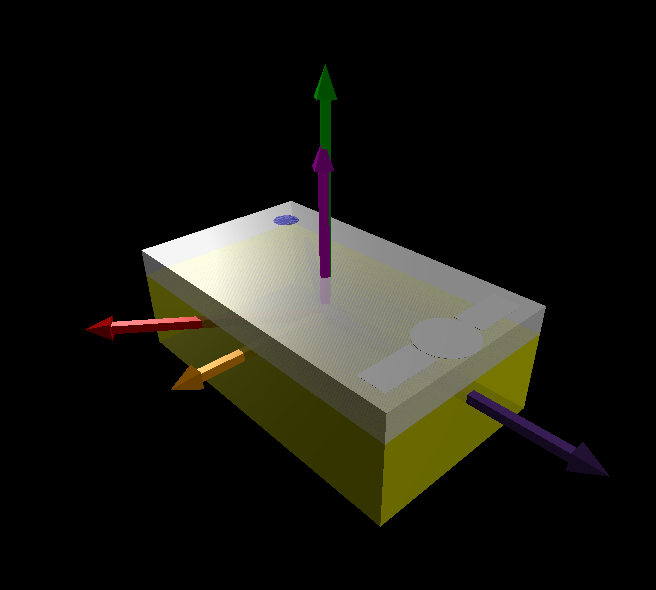

# Real time 3d view of SPIKE orientation

This demo uses the angles `yaw`, `pitch`, and `roll` as output by the IMU of the SPIKE hub to plot a real time 3D presenation of the SPIKE on the PC. The movements of the real SPIKE are shown in real time on the model.

 


## Running the demo

This project uses websockets. Therefore, the two files: `ws_connection.py` and `ws_server.py` need to be copied to the ESP8266. This can be done by using the WebREPL upload function. Then, paste the code of `imu3d_SPIKE.py` in an empty python project in the Lego Education SPKE Prime IDE. Connect the ESP8266 module (in this example it is connected to port "A"). Execute the code. The IP address of the websocket is shown in the console of the IDE.

On your PC, edit the file `imu3d_SPIKE.py` with the correct websocket address. Run the code. For installation of VPython see below.

## Websockets

Websockets are used for the communication between the ESP8266 and the VPython code. Using the `uartremote` library, the SPIKE sends it's measured values of yaw, pitch and rolw angles to the ESP8266.

## VPython
 On the PC the 3d represenation is created using VPython. this is an easy to use 3d library. VPython uses a browser window as output terminal.

 You can install VPyhton with:

 ```
 pip3 install vpython
 ```
## Rotations and trigoniometry

From http://planning.cs.uiuc.edu/node102.html the matrices for rotating over the yaw and pitch angles are given in 3D. The unit vector `[1,0,0]` multiplied by the product of these two matrices gives:
  
See this [calculation](https://www.wolframalpha.com/input/?i=%5B%5Bcos%28a%29%2C-sin%28a%29%2C0%5D%2C%5Bsin%28a%29%2Ccos%28a%29%2C0%5D%2C%5B0%2C0%2C1%5D%5D*%5B%5Bcos%28b%29%2C0%2Csin%28b%29%5D%2C%5B0%2C1%2C0%5D%2C%5B-sin%28b%29%2Ccos%28b%29%2C0%5D%5D) in  Wolfram Alpha which results in:

```
[
cos(a) cos(b) | -sin(a) | cos(a) sin(b)
sin(a) cos(b) | cos(a)  | sin(a) sin(b)
-sin(b)       | cos(b)  | 0
]
```

where the first column is `[cos(a) cos(b), sin(a) cos(b), -sin(b)]` with `a` the yaw and `b` the pitch angle.

Then we need to rotate the upwards pointing vector `v` around the vector `k` along the length axis of the SPIKE for incorporating the roll. This rotation is described by the [Rodrigues' rotation formula](https://en.wikipedia.org/wiki/Rodrigues%27_rotation_formula). Here a term cancels because the vector `v` and `k` are perpendicular, so that the inner product is 0. The new rotated vector `vrot` is then used to align the `up` vector of the upwards pointing arrow and the SPIKE object as a whole.
