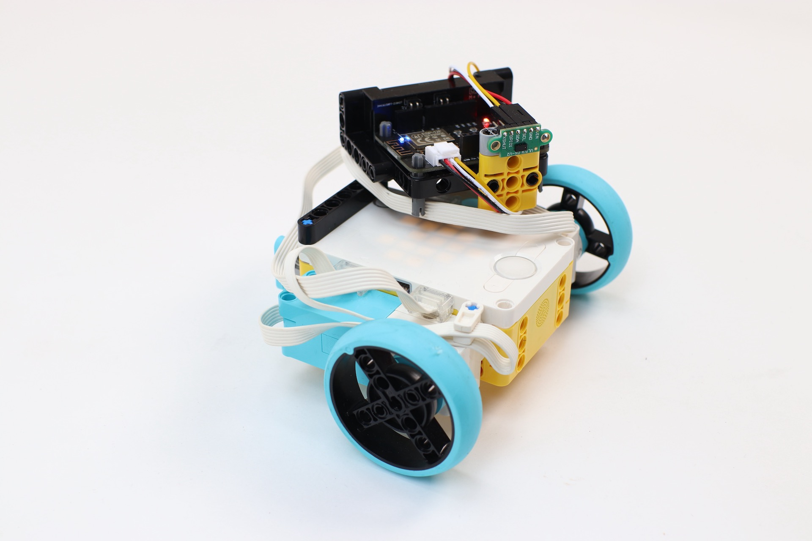
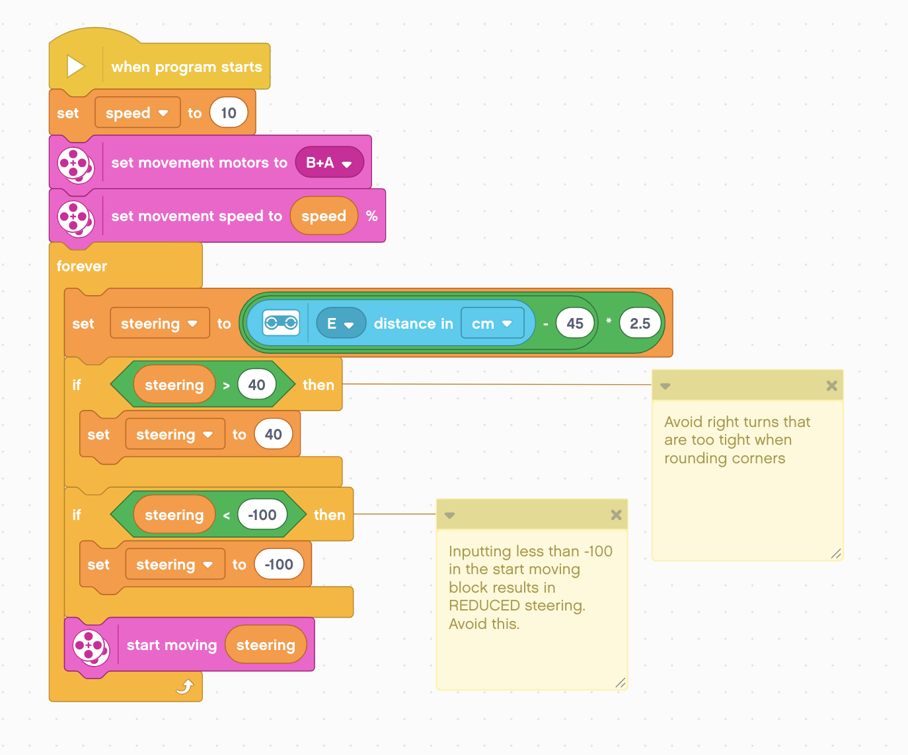

# Laser range finder for SPIKE Prime
This project emulates an LPF2/SPIKE Prime/Robot Inventor distance sensor, but uses a vl53l0x-v2 time-of-flight laser range finder to get distance readings.

# Installation
- Copy all files in the esp-wifi-board folder to the esp-wifi-board using [the WebREPL](https://github.com/antonvh/LMS-uart-esp/wiki/Connecting-via-webrepl).
- Run the SPIKE Prime word blocks wall follower program using the SPIKE Prime software.

# Hardware
- [SPIKE Prime or Robot Inventor kit](https://www.lego.com/nl-nl/product/lego-education-spike-prime-set-45678)
- [Distance sensor breakout board with ESP-wifi-board](https://antonsmindstorms.com/product/wifi-i2c-with-distance-sensor-breakout-bundle/)

# Background info
The esp-wifi-board folders contains compiled mpy files of the needed libraries. You can check their full source code in the Libraries/LPF2 folder

