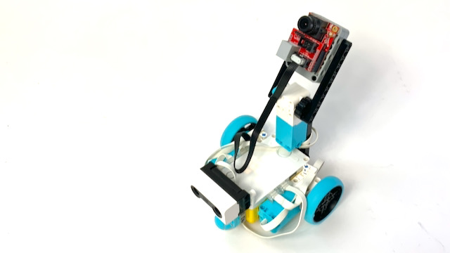

# Face detection and Vl053x time of flight sensor

This project connects an openMV to a LEGO Spike prime hub. The spike project tells the camera to detect faces.

## Materials used
- SPIKE Prime kit
- [OpenMV Camera](openmv.io)
- [LMS-uart-convertor-board](https://antonsmindstorms.com/product/uart-breakout-board-for-spike-and-ev3-openmv-compatible/)

## Setup
Build a robot similar to the picture.

If camera points 'forward' then motor A is left, from the camera's perspective and motor B is right. Motor C does the elevation. Counterclockwise makes the camera point further upward. The camera with the breakout board should be in port f.

Copy everything from the OpenMV folder to the OpenMV flash drive over usb.

Create a new SPIKE Prime project and copy the Spike code in there. Connect the SPIKE hub and run the program.